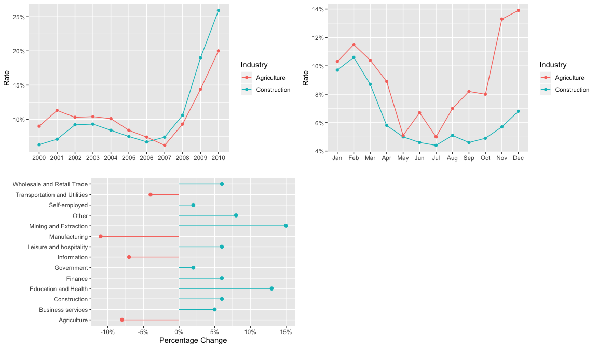

dash\_plots
================
Braden Tam
07/12/2019

``` r
library(tidyverse)
```

    ## ── Attaching packages ────────────────────────────────────────────────────────────────────────────────────────────────── tidyverse 1.2.1 ──

    ## ✔ ggplot2 3.2.1     ✔ purrr   0.3.3
    ## ✔ tibble  2.1.3     ✔ dplyr   0.8.3
    ## ✔ tidyr   1.0.0     ✔ stringr 1.4.0
    ## ✔ readr   1.3.1     ✔ forcats 0.4.0

    ## ── Conflicts ───────────────────────────────────────────────────────────────────────────────────────────────────── tidyverse_conflicts() ──
    ## ✖ dplyr::filter() masks stats::filter()
    ## ✖ dplyr::lag()    masks stats::lag()

``` r
library(scales)
```

    ## 
    ## Attaching package: 'scales'

    ## The following object is masked from 'package:purrr':
    ## 
    ##     discard

    ## The following object is masked from 'package:readr':
    ## 
    ##     col_factor

``` r
unemply_df_year <- read_csv("data/unemply_df_year.csv")
```

    ## Warning: Missing column names filled in: 'X1' [1]

    ## Parsed with column specification:
    ## cols(
    ##   X1 = col_double(),
    ##   year = col_double(),
    ##   industry = col_character(),
    ##   count = col_double(),
    ##   rate = col_double(),
    ##   total = col_double()
    ## )

``` r
unemply_df_month <- read_csv("data/unemply_df_month.csv")
```

    ## Warning: Missing column names filled in: 'X1' [1]

    ## Parsed with column specification:
    ## cols(
    ##   X1 = col_double(),
    ##   industry = col_character(),
    ##   year = col_double(),
    ##   month = col_double(),
    ##   count = col_double(),
    ##   rate = col_double()
    ## )

``` r
df <- unemply_df_year %>%
  select(-c(count, rate, X1))

df <- df  %>%
  spread(key = 'year', value = 'total')


# plot 1
make_plot_1 <- function(year_range = c(2000, 2003), stat = "rate"){

  new_df <- df %>%
    select(industry)
  if(stat == "rate"){
    new_df$rate <- unlist(round((df[as.character(year_range[2])] - df[as.character(year_range[1])]) / df[as.character(year_range[1])], 2))
    new_df <- new_df %>%
       mutate(colour = ifelse(rate < 0, "type1", "type2"))

    ggplot(new_df, aes(industry, rate, colour = colour)) + 
      geom_segment(aes(xend = industry, y = 0, yend = rate)) +
      geom_point(size = 2) + 
      coord_flip() + 
      scale_y_continuous(labels = percent_format(accuracy = 1L)) + 
      theme(legend.position = "none") +
      labs(x = '', y = 'Percentage Change')
  
  } else {
    new_df$count <- unlist(round((df[as.character(year_range[2])] - df[as.character(year_range[1])])))
    new_df <- new_df %>%
      mutate(colour = ifelse(count < 0, "type1", "type2"))
  
    ggplot(new_df, aes(industry, count, colour = colour)) + 
      geom_segment(aes(xend = industry, y = 0, yend = count)) +
      geom_point(size = 2) + 
      coord_flip() + 
      theme(legend.position = "none") +
      labs(x = ' ', y = 'Absolute Change')
  }
}

# plot 2
make_plot_2 <- function(industries = c("Agriculture", "Construction"), stat = "rate"){
  
  new_df <- unemply_df_year %>%
    filter(industry %in% industries)
  if(stat == "rate"){
    ggplot(new_df, aes(factor(year), rate, colour = industry, group = industry)) + 
      geom_line() + 
      geom_point() + 
      scale_y_continuous(labels = percent_format(accuracy = 1L)) + 
      labs(x = '', y = 'Rate', colour = 'Industry')
  } else {
    ggplot(new_df, aes(factor(year), count, colour = industry, group = industry)) + 
      geom_line() + 
      geom_point() + 
      labs(x = '', y = 'Count', colour = 'Industry')
  }   
}

# plot 3
make_plot_3 <- function(industries = c("Agriculture", "Construction"), year_desired = 2000, stat = "rate"){
  avg_df <- unemply_df_month %>%
    group_by(month) %>%
    summarize(rate = mean(rate),
              count = mean(count))
  
  new_df <- unemply_df_month %>%
    filter(year == year_desired,
           industry %in% industries)
  if(stat == "rate"){
    ggplot(new_df, aes(factor(month), rate, colour = industry, group = industry)) + 
      geom_line() + 
      geom_point() +
      scale_y_continuous(labels = percent_format(accuracy = 1L)) + 
      scale_x_discrete(breaks = seq_along(1:12), labels=c("Jan", "Feb", "Mar", "Apr", "May", "Jun", 
                                                          "Jul", "Aug", "Sep", "Oct", "Nov", "Dec")) +
      labs(x = '', y = 'Rate', colour = 'Industry')
  } else {
    ggplot(new_df, aes(factor(month), count, colour = industry, group = industry)) + 
      geom_line() + 
      geom_point() + 
      scale_x_discrete(breaks = seq_along(1:12), labels=c("Jan", "Feb", "Mar", "Apr", "May", "Jun", 
                                                          "Jul", "Aug", "Sep", "Oct", "Nov", "Dec")) +
      labs(x = '', y = 'Count', colour = 'Industry')
    
  }
}

# ggplot() + 
#   geom_line(new_df, mapping = aes(factor(month), rate, colour = industry, group = industry)) + 
#   geom_point(new_df, mapping = aes(factor(month), rate, colour = industry, group = industry)) + 
#   geom_line(avg_df, mapping = aes(month, rate), alpha = 0.5, linetype = 'dashed') +
#   labs(x = '', y = 'Unemployment Rate', colour = 'Industry')
```

    ## 
    ## ********************************************************

    ## Note: As of version 1.0.0, cowplot does not change the

    ##   default ggplot2 theme anymore. To recover the previous

    ##   behavior, execute:
    ##   theme_set(theme_cowplot())

    ## ********************************************************

<!-- -->
